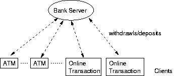

# DistributedOS

## Environments:

All tests are on Ubuntu 16.04 LTS, g++ (Ubuntu 5.4.0-6ubuntu1~16.04.12) 5.4.0 20160609.

# Project 1: A Centralized Multi-User Concurrent Bank Account Manager (Multithreading, Mutex)

The system has two important components:
1. **Bank Server**: 
The server program that services online requests for account manipulations and maintains all customer records correctly.
2. **Clients**: 
Customers are clients of the bank server and use its services to update bank accounts. The operations that can be performed on an account are: withdrawl of an amount from an account and deposit of an amount into an account. Additionally, the bank server can have it's own service that periodically deposits an interest amount to each account based on some fixed rate.

System architecture:

State diagram for server and client model:

More assignment details [PDF here](./proj1_centralized_multiuser_bank/doc/Project_1_Fall_2021.pdf), [HTML here](http://lass.cs.umass.edu/~shenoy/courses/spring05/labs/project1.html).

References:

Socket:

1. https://www.geeksforgeeks.org/socket-programming-cc/?ref=lbp
2. https://stackoverflow.com/a/69309213/9593219

Multithread:

3. https://stackoverflow.com/questions/38153680/integrating-pthread-create-and-pthread-join-in-the-same-loop

