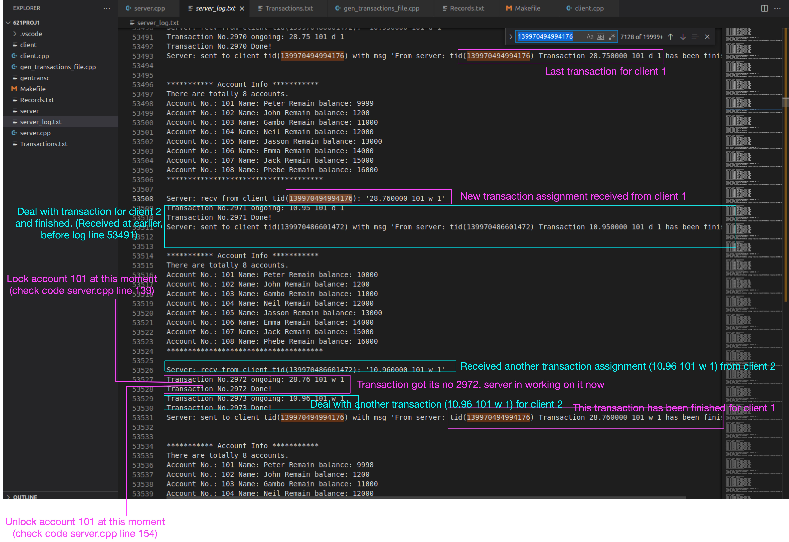
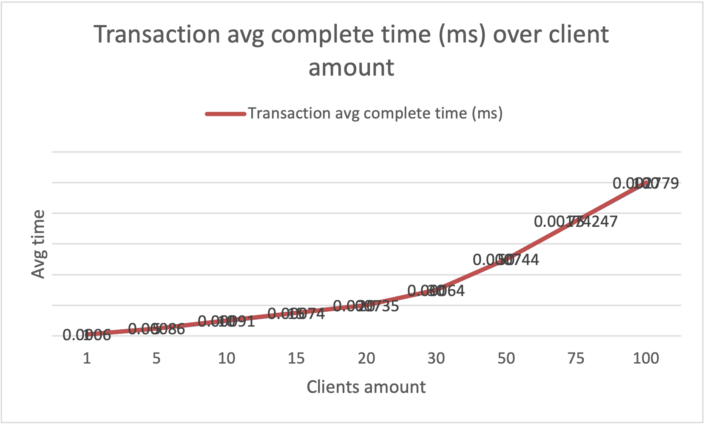
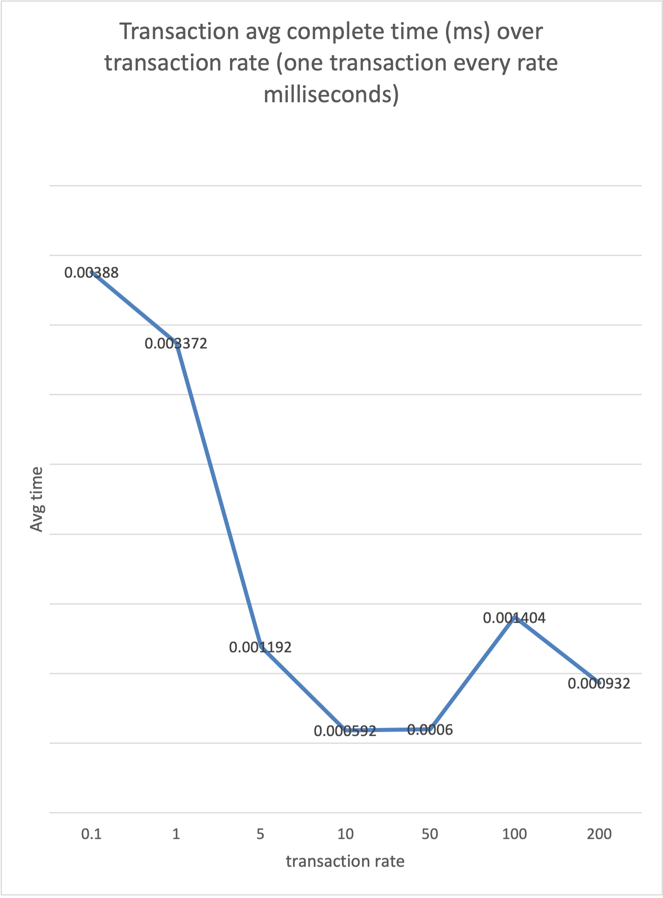

# DistributedOS

This is my cpp implementation of a centralized bank account management system. It supports one server and multtiple clients. The server creates a seperate thread for each client. It ensures the data safety on server side via adding mutex/lock on account data.

## Environments:

All tests are on Ubuntu 16.04 LTS, g++ (Ubuntu 5.4.0-6ubuntu1~16.04.12) 5.4.0 20160609.


# Project 1: A Centralized Multi-User Concurrent Bank Account Manager (Multithreading, Synchronization, Mutex)

The system has two important components:
1. **Bank Server**: 
The server program that services online requests for account manipulations and maintains all customer records correctly.
2. **Clients**: 
Customers are clients of the bank server and use its services to update bank accounts. The operations that can be performed on an account are: withdrawl of an amount from an account and deposit of an amount into an account. Additionally, the bank server can have it's own service that periodically deposits an interest amount to each account based on some fixed rate.

System architecture:


State diagram for server and client model:


More assignment details [PDF here](./proj1_centralized_multiuser_bank/doc/Project_1_Fall_2021.pdf), [HTML here](http://lass.cs.umass.edu/~shenoy/courses/spring05/labs/project1.html).


## Project 1 Implementation:

Check out [this directory](proj1_centralized_multiuser_bank/src).

- Phase 1 (Version 1): Socket programming (without multithreads).

- Phase 2 (Version 2): Add multithreads on Phase 1.

- Phase 3 (Version 3): Add mutex (lock) on each account at server side Phase 2. (Add account initialization functions first.) 

- Phase 4 (Version 4): Add other necessary operation functions. Complete.
  - Write a gen_transactions_file.cpp file to generate high volume transactions.
  - read transactions
  - withdraw / deposit
  
- Phase 5 (Version 5): Tailor for scalability.
  - Remove client ternimate input request
  - Add bash script to launch  multiple ./client parallelly
  - Count time for each transaction
  - Conduct experiments for scalability

## Explanation

A [video](https://www.youtube.com/watch?v=fOTTy4Zn5cc) is also provided to explane my implementation.

### **1. Synchronization**
   
The assignment says "It should provide locking/protection for access to an account records during shared access (i.e., a user might be depositing money into his account and at the same time an online billing agent might be withdrawing money from the same account). Such cases need to be correctly handled by protecting variables in the critical section."

I set up a mutex lock for each account. So when d/w it will ask for the lock first and then finish the transaction operation, followed by unlock corresponding account. Check out server.cpp line 132 transaction_oper() function.


### **2. High transaction volume (synchronization proof)**

If the transaction amount is small, like 1000, the server deal with them quickly and cannot generate the running time overlap between  multiple clients. The server executes transactions so fast, making the execution become sequential, i.e. it finishes all 1000 transactions for client 1 (because so fast) and then finishes all 1000 transacttionf for client 2. 

So I set up 10000 transactions (rate = 10, every one transaction per 10 milliseconds) and all on the  same account 101, insuring there will be a running time overlap between two clients in my demonstration. This generated a about 2 seconds overlap, i.e. the last 2 s running time of transactions of client 1 and the first 2 s running time of transactions of client 2. During these 2s the 2 client threads competed for the lock of the account 101. 


To run it, open first terminal, run 
```linux
cd proj1_centralized_multiuser_bank/src/v4_add_transaction_operations
```
```linux
make
```
```linux
./gentransc 
```
```linux
./server 
```

Open second termial, run
```linux
./client 
```

Open third termial, run
```linux
./client 
```

This run the server with 2 clients, check out [v4_add_transaction_operations/server_log.txt](proj1_centralized_multiuser_bank/src/v4_add_transaction_operations/server_log.txt) of my print-out of server side.

Below is the screenshot that shows Synchronization.


### **3. Scalability**

### **Transaction avg complete time (ms) over clients amount**

Use [v5_scalability/gen_transactions_file.cpp](proj1_centralized_multiuser_bank/src/v5_scalability/gen_transactions_file.cpp) and [v5_scalability/launch_multi_clients.sh](proj1_centralized_multiuser_bank/src/v5_scalability/launch_multi_clients.sh).


To run it, open first terminal, run 
```linux
cd proj1_centralized_multiuser_bank/src/v5_scalability
```
```linux
make
```
```linux
./gentransc 
```
```linux
./server 
```

Open second termial, run
```linux
./launch_multi_clients.sh 
```
 
|||||||||||
|-|-|-|-|-|-|-|-|-|-|
|Clients amount|1|5|10|15|20|30|50|75|100|
|Transaction avg complete time (ms)|0.0006|0.00086|0.00091|0.00074|0.000735|0.00064|0.000744|0.00174247|0.002779|
||




### **Transaction avg complete time (ms) over transaction rate (one transaction every rate milliseconds)**

Use [v5_scalability/gen_transactions_file_w_rate.cpp](proj1_centralized_multiuser_bank/src/v5_scalability/gen_transactions_file_w_rate.cpp) and [v5_scalability/launch_25_clients_w_rate.sh](proj1_centralized_multiuser_bank/src/v5_scalability/launch_25_clients_w_rate.sh).


To run it, open first terminal, run 
```linux
cd proj1_centralized_multiuser_bank/src/v5_scalability
```
```linux
make
```
```linux
./server 
```

Modify the rate as you want in the file "launch_25_clients_w_rate.sh".

Then open second termial, run
```linux
./launch_25_clients_w_rate.sh 
```

||||||||||
|-|-|-|-|-|-|-|-|-|
|rate|0.1|1|5|10|50|100|200|
|Transaction avg complete time (ms)|0.00388|0.003372|0.001192|0.000592|0.0006|0.001404||0.000932|
||



### References:

Socket:

1. [Socket programming example 1](https://www.geeksforgeeks.org/socket-programming-cc/?ref=lbp)
2. [Socket programming example 2](https://stackoverflow.com/a/69309213/9593219)

Multithread:

3. [pthread_join need to be outside of pthread_create loop](https://stackoverflow.com/questions/38153680/integrating-pthread-create-and-pthread-join-in-the-same-loop)

Mutex:

4. [pthread_mutex](https://stackoverflow.com/questions/34100575/c-using-mutex-in-multithreaded-client-and-server)

C++ programming tricks:

5. [use typedef for struct](https://stackoverflow.com/questions/32577808/how-to-create-a-new-instance-of-a-struct)

6. [c++ need cast the result of malloc](https://stackoverflow.com/a/52362916/9593219)

7. [c++ static cast](https://stackoverflow.com/questions/15937309/errorpe513-a-value-of-type-void-cannot-be-assigned-to-an-entity-of-type)
8. [c++ calc duration time using milliseconds](https://www.delftstack.com/howto/cpp/how-to-get-time-in-milliseconds-cpp/)
9. [c++ append string at the end of a file](https://stackoverflow.com/a/6932451/9593219)
10. [c++ <unistd.h> sleep() round down, sleep(0.9) = sleep(0)](https://pubs.opengroup.org/onlinepubs/7908799/xsh/sleep.html)

Linux:

11. [Launch multiple ./client programs in parallel from a bash script](https://stackoverflow.com/a/3004814/9593219)
